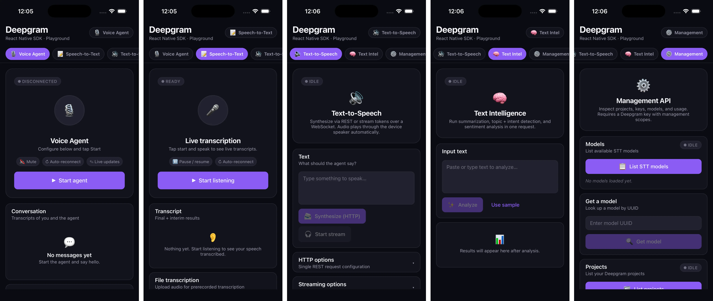

# react-native-deepgram

[](https://badge.fury.io/js/react-native-deepgram)
[](https://opensource.org/licenses/MIT)

The complete client for Deepgram's voice AI platform on **React Native** and **Expo** — real-time transcription, conversational voice agents, text-to-speech, and text intelligence in a single dependency, with hardware echo cancellation and background-audio support wired up for you.

```bash
yarn add react-native-deepgram
```

## At a glance

| | |
| --- | --- |
| 🗣️ **Voice Agent** | Full-duplex agents over Deepgram's WebSocket. Hardware AEC on iOS (VPIO) and Android (`VOICE_COMMUNICATION` + `MODE_IN_COMMUNICATION`). Function calling, prompt updates, latency telemetry. |
| 🎙️ **Speech-to-Text** | Live PCM streaming over WebSocket on STT v1 *or* Flux v2 (`flux-general-en`). File transcription with summarisation, topics, intents, entities. |
| 🔊 **Text-to-Speech** | One-shot HTTP synthesis or low-latency WebSocket streaming with `Speak` / `Flush` / `Clear` / `Close` controls. |
| 🧠 **Text Intelligence** | Summaries, topics, intents, sentiment over text or URLs. |
| 🛠️ **Management API** | Typed wrapper for projects, models, keys, usage, balances, members, invitations, scopes, purchases, and temporary tokens. |
| ⚙️ **Expo plugin** | One-line install — handles permissions, background-audio modes, and Android foreground service automatically. |
| 🧰 **Resilient by default** | Audio interruptions, route changes, headphone unplugging, mediaserverd resets, audio-focus loss, and queue overflow are all handled — plus opt-in WebSocket auto-reconnect with exponential backoff. |
| 🆕 **Modern iOS APIs** | `AVAudioApplication.requestRecordPermission` and `AllowBluetoothHFP` on iOS 17+, with safe fallbacks. |

---

## Table of contents

1. [Quick start (5 minutes)](#quick-start-5-minutes)
2. [Requirements](#requirements)
3. [Installation](#installation)
4. [Core concepts](#core-concepts)
5. [Audio session, AEC & background](#audio-session-aec--background)
6. [Voice Agent](#voice-agent-usedeepgramvoiceagent)
7. [Speech-to-Text](#speech-to-text-usedeepgramspeechtotext)
8. [Text-to-Speech](#text-to-speech-usedeepgramtexttospeech)
9. [Text Intelligence](#text-intelligence-usedeepgramtextintelligence)
10. [Management API](#management-api-usedeepgrammanagement)
11. [Expo config plugin reference](#expo-config-plugin-reference)
12. [Common recipes](#common-recipes)
13. [Troubleshooting](#troubleshooting)
14. [Example app](#example-app)
15. [Roadmap](#roadmap)
16. [Contributing](#contributing)
17. [License](#license)

---

## Quick start (5 minutes)

### 1. Install

```bash
yarn add react-native-deepgram
```

### 2. Configure the Expo plugin

```js
// app.config.js (or app.json under "plugins")
module.exports = {
  expo: {
    plugins: [
      [
        'react-native-deepgram',
        {
          microphonePermission:
            'Allow $(PRODUCT_NAME) to access your microphone.',
        },
      ],
    ],
  },
};
```

```bash
npx expo prebuild
npx expo run:ios   # or expo run:android
```

> Bare React Native? Skip the plugin, run `cd ios && pod install`. The package autolinks via `react-native.config.js`.

### 3. Configure the SDK once at startup

```ts
// App.tsx
import { configure } from 'react-native-deepgram';

configure({ apiKey: process.env.EXPO_PUBLIC_DEEPGRAM_API_KEY! });
```

> **Never ship raw API keys.** Use `EXPO_PUBLIC_*` env vars, secrets storage, or a backend proxy that mints scoped keys.

### 4. Stream microphone audio to Deepgram (live STT)

```tsx
import { useDeepgramSpeechToText } from 'react-native-deepgram';
import { Button, Text, View } from 'react-native';

export function LiveCaption() {
  const {
    startListening,
    stopListening,
    state,         // { status: 'idle' | 'listening' | 'error' | ... }
    transcript,    // accumulated final transcript
    interimTranscript, // current partial
  } = useDeepgramSpeechToText({
    trackState: true,
    trackTranscript: true,
    live: { punctuate: true, interimResults: true },
  });

  return (
    <View>
      <Text>{transcript} {interimTranscript}</Text>
      <Button title="Start" onPress={() => startListening()} />
      <Button title="Stop" onPress={stopListening} />
      {state.error && <Text style={{ color: 'red' }}>{String(state.error)}</Text>}
    </View>
  );
}
```

### 5. Talk to a Voice Agent (full-duplex with AEC)

```tsx
import { useDeepgramVoiceAgent } from 'react-native-deepgram';

const agent = useDeepgramVoiceAgent({
  trackState: true,
  trackConversation: true,
  defaultSettings: {
    audio: {
      input:  { encoding: 'linear16', sample_rate: 24_000 },
      output: { encoding: 'linear16', sample_rate: 24_000, container: 'none' },
    },
    agent: {
      language: 'en',
      greeting: 'Hi! What can I help you with?',
      listen: { provider: { type: 'deepgram', model: 'nova-3' } },
      think:  { provider: { type: 'open_ai', model: 'gpt-4o' }, prompt: 'You are a helpful assistant.' },
      speak:  { provider: { type: 'deepgram', model: 'aura-2-asteria-en' } },
    },
  },
});

await agent.connect();          // requests mic, opens WS, starts streaming
agent.injectUserMessage('Hi'); // optional: prompt the agent with text
agent.disconnect();             // tears everything down
```

That's a working, low-latency conversational agent with hardware echo cancellation. Open [the example app](#example-app) to try the full surface area.

---

## Requirements

| | Minimum |
| --- | --- |
| Node | 18 |
| React | 18.0 |
| React Native | 0.72 |
| iOS | 13 (15+ recommended for VPIO AEC) |
| Android | API 24 (Android 7.0) |
| Xcode | 15+ if building against the iOS 17 SDK |

> The library is published with the New Architecture in mind but works on the legacy renderer as well.

---

## Installation

```bash
yarn add react-native-deepgram
# or
npm install react-native-deepgram
```

### Bare React Native

```bash
cd ios && pod install
```

The package is autolinked through `react-native.config.js` — no manual `MainApplication` edits required.

### Expo (managed or bare)

Add the plugin to your config:

```js
// app.config.js
module.exports = {
  expo: {
    plugins: [
      [
        'react-native-deepgram',
        {
          microphonePermission:
            'Allow $(PRODUCT_NAME) to access your microphone.',
          // backgroundAudio: true, // default — see plugin docs below
        },
      ],
    ],
  },
};
```

Then prebuild and run:

```bash
npx expo prebuild
npx expo run:ios   # or expo run:android
```

> Already running an existing development build? Re-run `expo prebuild` (and `pod install` on iOS) so the new permissions, background modes, and Android foreground service are picked up.

---

## Core concepts

A few ideas you only have to learn once.

### 1. Configure once, use anywhere

```ts
import { configure } from 'react-native-deepgram';
configure({ apiKey: process.env.EXPO_PUBLIC_DEEPGRAM_API_KEY! });
```

`configure` is global — call it at the entry point (e.g. `App.tsx`). Every hook reads from this config. The Management API additionally needs a key with management scopes.

> **Never ship raw API keys.** Use `EXPO_PUBLIC_*` env vars, secrets storage, or a backend proxy that mints scoped keys.

#### Custom endpoints (regional, Dedicated & self-hosted)

Point the SDK at a non-default Deepgram deployment by passing base URLs to `configure`. Every override is optional and falls back to the public Deepgram endpoints.

```ts
configure({
  apiKey: process.env.EXPO_PUBLIC_DEEPGRAM_API_KEY!,
  baseUrl: 'https://api.beta.deepgram.com/v1', // REST (must include the version segment)
  baseWss: 'wss://api.beta.deepgram.com/v1',   // live STT + streaming TTS sockets
  agentUrl: 'wss://agent.deepgram.com/v1/agent/converse', // Voice Agent socket
});
```

| Option | Applies to | Default |
| ------ | ---------- | ------- |
| `baseUrl` | REST calls (file STT, TTS, Text Intelligence, Management) | `https://api.deepgram.com/v1` |
| `baseWss` | Live STT + streaming TTS sockets | `wss://api.deepgram.com/v1` |
| `agentUrl` | Voice Agent socket | `wss://agent.deepgram.com/v1/agent/converse` |

`baseUrl`/`baseWss` **must include the version segment** (`/v1`). Flux v2 endpoints are derived automatically by swapping the trailing `/v1` for `/v2`. See Deepgram's [custom endpoints reference](https://developers.deepgram.com/reference/custom-endpoints).

#### Ephemeral / scoped tokens (keep your API key off-device)

Instead of shipping a long-lived `apiKey`, you can hand `configure` a `getToken` provider that returns a short-lived Deepgram token minted by your backend (which proxies Deepgram's [`/v1/auth/grant`](https://developers.deepgram.com/reference/token-based-auth-api/grant-token)). The SDK caches the token, refreshes it before it expires, and de-duplicates concurrent refreshes — so a burst of requests never triggers multiple grants.

```ts
configure({
  // No raw apiKey on the device. `getToken` takes precedence when provided.
  getToken: async () => {
    const res = await fetch('https://your-backend.example.com/deepgram-token');
    const { access_token, expires_in } = await res.json();
    return { token: access_token, expiresInSeconds: expires_in };
  },
});
```

| Field | Type | Description |
| ----- | ---- | ----------- |
| `token` | `string` | The short-lived token. Sent as `Authorization: Bearer <token>`. |
| `expiresInSeconds` | `number` (optional) | TTL hint used to refresh ahead of expiry. Defaults to `30`. |

- When both `getToken` and `apiKey` are set, `getToken` wins; the API key is the fallback.
- The token only needs to be valid at connection time — live STT / Voice Agent sockets keep running after it expires.
- **Exception:** the Management API (`useDeepgramManagement`) cannot authenticate with temporary tokens, so it always uses the configured `apiKey`.

### 2. Hooks return reactive state — opt in

Every hook supports `track*` flags that turn on a reactive return value. Without them, the hook stays event-driven (callbacks only) so it never causes unnecessary re-renders.

```ts
const { transcript, state } = useDeepgramSpeechToText({
  trackTranscript: true,  // exposes `transcript` + `interimTranscript`
  trackState: true,       // exposes `state.status`, `state.error`
});
```

| Hook | Tracking flags |
| --- | --- |
| `useDeepgramVoiceAgent` | `trackState`, `trackConversation`, `trackAgentStatus` |
| `useDeepgramSpeechToText` | `trackState`, `trackTranscript` |
| `useDeepgramTextToSpeech` | `trackState` |
| `useDeepgramTextIntelligence` | `trackState` |

### 3. Audio session is automatic

You don't manage `AVAudioSession`, `AudioManager`, or focus. The native module activates the right session category, switches to `VoiceChat` / `MODE_IN_COMMUNICATION` when echo cancellation is enabled, requests/abandons audio focus, starts/stops a foreground service on Android, and rebuilds after `mediaserverd` resets on iOS.

For tuning details, see [Audio session, AEC & background](#audio-session-aec--background).

### 4. Hooks at a glance

| Hook | Purpose | Endpoint |
| --- | --- | --- |
| `useDeepgramVoiceAgent` | Conversational agents (full-duplex) | `wss://agent.deepgram.com/v1/agent/converse` |
| `useDeepgramSpeechToText` | Live STT + file transcription | `wss://api.deepgram.com/v1/listen` (v1) / `/v2/listen` (Flux) |
| `useDeepgramTextToSpeech` | TTS via REST or streaming | `https://api.deepgram.com/v1/speak` & `wss://api.deepgram.com/v1/speak` |
| `useDeepgramTextIntelligence` | Summaries, topics, intents, sentiment | `https://api.deepgram.com/v1/read` |
| `useDeepgramManagement` | Projects / keys / usage REST API | `https://api.deepgram.com/v1` |

---

## Audio session, AEC & background

This section covers what the native module does for you so you can debug or tune behaviour with confidence.

### Hardware echo cancellation (full-duplex)

When you build a Voice Agent (or any duplex flow where Deepgram is speaking *and* the mic is open), set `enableVoiceProcessing: true`:

```ts
import { Deepgram } from 'react-native-deepgram';

await Deepgram.startRecording({ enableVoiceProcessing: true });
```

`useDeepgramVoiceAgent` opts into this automatically. What this gives you:

| Platform | Behaviour |
| --- | --- |
| iOS | Capture is routed through `AVAudioEngine.inputNode` with `setVoiceProcessingEnabled:YES` on both input and output, and the audio session uses `AVAudioSessionModeVoiceChat`. This engages Apple's Voice-Processing I/O Audio Unit — the only way to get hardware AEC on iOS. |
| Android | Capture uses `MediaRecorder.AudioSource.VOICE_COMMUNICATION` and the system is set to `MODE_IN_COMMUNICATION` so the platform's hardware AEC engages with the active playback signal as its reference. The previous mode is restored on `stopRecording`. |

For pure speech-to-text usage you generally **don't** want this — leave the option off (the default). STT-only paths use `VOICE_RECOGNITION` on Android and a pure AudioQueue capture on iOS so Deepgram receives the rawest possible signal.

### Background audio

Leave `backgroundAudio: true` on the Expo plugin (it's the default) to keep playback and capture alive when the user leaves the app:

- **iOS** — `UIBackgroundModes: ["audio"]` is added to your `Info.plist`.
- **Android** — a foreground service (`DeepgramAudioService`) is bundled with `foregroundServiceType=microphone|mediaPlayback` and the matching `FOREGROUND_SERVICE`, `FOREGROUND_SERVICE_MICROPHONE`, `FOREGROUND_SERVICE_MEDIA_PLAYBACK` permissions are merged into your manifest. The service is started/stopped automatically whenever recording or playback is active.

### Built-in resilience

The native modules handle the awkward edge cases for you:

- **Audio interruptions** — phone calls, Siri, system alerts pause + resume cleanly on iOS.
- **Route changes** — unplugging headphones or disconnecting Bluetooth pauses playback (instead of suddenly blasting through the speaker), matching Apple's `AVAudioSessionRouteChangeReasonOldDeviceUnavailable` guidance and Android's `ACTION_AUDIO_BECOMING_NOISY` broadcast.
- **Audio focus loss (Android)** — transient losses pause playback; permanent losses tear down recording + playback so you don't fight other apps for the mic.
- **mediaserverd resets (iOS)** — if iOS restarts its audio service mid-session, the audio engine is rebuilt from scratch on the next call.
- **Bluetooth on iOS 17+** — uses `AllowBluetoothHFP` when available, with a deprecation-safe fallback for older toolchains.
- **iOS 17+ permission API** — `requestMicPermission` calls `AVAudioApplication.requestRecordPermissionWithCompletionHandler` when available, falling back to `AVAudioSession` on older OS versions.
- **Bounded playback queue (Android)** — if JS feeds audio faster than the device can play it, the oldest chunks are dropped at ~1.5 MB so you never OOM mid-call.

---

## Voice Agent (`useDeepgramVoiceAgent`)

`useDeepgramVoiceAgent` connects to `wss://agent.deepgram.com/v1/agent/converse`, captures microphone audio, and optionally auto-plays the agent's streamed responses. It wraps the full Voice Agent messaging surface so you can react to conversation updates, function calls, warnings, and raw PCM audio.

> 🔊 **Hardware AEC enabled by default.** The hook calls `startRecording({ enableVoiceProcessing: true })`, so iOS routes capture through Apple's VPIO Audio Unit and Android switches to `VOICE_COMMUNICATION` + `MODE_IN_COMMUNICATION`. The result: the agent never hears itself speak, even on speakerphone. (Note: VPIO is not available in the iOS Simulator — test on a physical device.)

### Quick start

```tsx
const {
  connect,
  disconnect,
  state, // { connectionState, error, warning }
  agentStatus, // { thinking, latency }
  conversation, // Array<{ role, content }>
  injectUserMessage,
  sendFunctionCallResponse,
  updatePrompt,
} = useDeepgramVoiceAgent({
  trackState: true, // Enable reactive state tracking
  trackConversation: true, // Enable conversation history tracking
  trackAgentStatus: true, // Enable agent status tracking
  autoPlayAudio: true, // Automatically play agent audio
  defaultSettings: {
    audio: {
      input: { encoding: 'linear16', sample_rate: 24_000 },
      output: { encoding: 'linear16', sample_rate: 24_000, container: 'none' },
    },
    agent: {
      language: 'en',
      greeting: 'Hello! How can I help you today?',
      listen: {
        provider: { type: 'deepgram', model: 'nova-3', smart_format: true },
      },
      think: {
        provider: { type: 'open_ai', model: 'gpt-4o', temperature: 0.7 },
        prompt: 'You are a helpful voice concierge.',
      },
      speak: {
        provider: { type: 'deepgram', model: 'aura-2-asteria-en' },
      },
    },
    tags: ['demo'],
  },
  onConversationText: (msg) => {
    console.log(`${msg.role}: ${msg.content}`);
  },
  onAgentThinking: (msg) => console.log('thinking:', msg.content),
  onAgentAudioDone: () => console.log('Agent finished speaking'),
  onServerError: (err) => console.error('Agent error', err.description),
});

const begin = async () => {
  try {
    await connect();
  } catch (err) {
    console.error('Failed to start agent', err);
  }
};

const askQuestion = () => {
  injectUserMessage("What's the weather like?");
};

const provideTooling = () => {
  sendFunctionCallResponse({
    id: 'func_12345',
    name: 'get_weather',
    content: JSON.stringify({ temperature: 72, condition: 'sunny' }),
    client_side: true,
  });
};

const rePrompt = () => {
  updatePrompt('You are now a helpful travel assistant.');
};

return (
  <>
    <Text>Status: {state.connectionState}</Text>
    <Button title="Start agent" onPress={begin} />
    <Button title="Ask" onPress={askQuestion} />
    <Button title="Send tool output" onPress={provideTooling} />
    <Button title="Update prompt" onPress={rePrompt} />
    <Button title="Stop" onPress={disconnect} />
  </>
);
```

> 💬 The hook requests mic permissions, streams PCM to Deepgram, and surfaces the agent's replies as text so nothing plays back into the microphone.

### API reference (Voice Agent)

**Signature**

```ts
const {
  // Connection
  connect, disconnect, isConnected,
  // Mic control
  mute, unmute, isMuted,
  // Messaging
  sendMessage, sendSettings, sendMedia, sendKeepAlive,
  injectUserMessage, injectAgentMessage, updatePrompt,
  // Function calls
  sendFunctionCallResponse,
  // Reactive state (opt-in via track* flags)
  state, conversation, agentStatus, clearConversation,
} = useDeepgramVoiceAgent(props);
```

#### Hook props

**Configuration**

| Prop | Type | Default | Description |
| ---- | ---- | ------- | ----------- |
| `endpoint` | `string` | `wss://agent.deepgram.com/v1/agent/converse` | WebSocket endpoint used for the agent conversation. |
| `defaultSettings` | `DeepgramVoiceAgentSettings` | – | Base `Settings` payload sent on connect; merge per-call overrides via `connect(override)`. |
| `autoStartMicrophone` | `boolean` | `true` | Automatically requests mic access and starts streaming PCM. |
| `autoPlayAudio` | `boolean` | `true` | Plays received audio using the native player. |
| `downsampleFactor` | `number` | heuristic | Manually override the downsample ratio applied to captured audio. |
| `reconnect` | `DeepgramReconnectOptions` | `{ enabled: false }` | Auto-reconnect config for the agent socket. The stored `Settings` payload is re-sent on every successful reconnect. |

**Reactive tracking flags** (opt-in — extra renders only when set)

| Prop | Default | Enables |
| ---- | ------- | ------- |
| `trackState` | `false` | `state` return — connection status, error, warning. |
| `trackConversation` | `false` | `conversation` return — running history of `{ role, content }`. |
| `trackAgentStatus` | `false` | `agentStatus` return — thinking flag and latency metrics. |

#### Callbacks

<details open>
<summary><strong>Lifecycle</strong> — connect/disconnect/error</summary>

| Callback | Signature | Fired when |
| -------- | --------- | ---------- |
| `onBeforeConnect` | `() => void` | `connect` is called, before mic prompt or socket open. |
| `onConnect` | `() => void` | Socket opens and the initial settings payload is delivered. |
| `onClose` | `(event?: any) => void` | Socket closes (manual disconnect or remote). |
| `onError` | `(error: unknown) => void` | Unexpected client-side error (mic, playback, socket send). |
| `onReconnecting` | `(attempt: number) => void` | A reconnect attempt begins (1-based attempt number). Requires `reconnect.enabled`. |
| `onReconnected` | `() => void` | The socket reconnects and the stored settings are re-sent. |
| `onServerError` | `(message: DeepgramVoiceAgentErrorMessage) => void` | API reports a structured error (`description` + `code`). |
| `onWarning` | `(message: DeepgramVoiceAgentWarningMessage) => void` | Non-fatal warning (e.g. degraded audio quality). |

</details>

<details>
<summary><strong>Conversation</strong> — text, audio, agent state</summary>

| Callback | Signature | Fired when |
| -------- | --------- | ---------- |
| `onWelcome` | `(message: DeepgramVoiceAgentWelcomeMessage) => void` | Agent returns the initial `Welcome` envelope. |
| `onSettingsApplied` | `(message: DeepgramVoiceAgentSettingsAppliedMessage) => void` | Settings are acknowledged by the agent. |
| `onConversationText` | `(message: DeepgramVoiceAgentConversationTextMessage) => void` | Transcript update (`role` + `content`) arrives. |
| `onUserStartedSpeaking` | `(message: DeepgramVoiceAgentUserStartedSpeakingMessage) => void` | Server-side VAD detects the user speaking. |
| `onAgentThinking` | `(message: DeepgramVoiceAgentAgentThinkingMessage) => void` | Agent reports internal reasoning state. |
| `onAgentStartedSpeaking` | `(message: DeepgramVoiceAgentAgentStartedSpeakingMessage) => void` | Response playback session begins (latency metrics included). |
| `onAgentAudioDone` | `(message: DeepgramVoiceAgentAgentAudioDoneMessage) => void` | Agent finishes emitting audio for a turn. |
| `onAudio` | `(audioData: ArrayBuffer) => void` | Raw binary audio chunk received from the socket. |
| `onPromptUpdated` | `(message: DeepgramVoiceAgentPromptUpdatedMessage) => void` | Active prompt is updated (e.g. after `updatePrompt`). |
| `onSpeakUpdated` | `(message: DeepgramVoiceAgentSpeakUpdatedMessage) => void` | Active speak configuration changes (server-driven). |
| `onListenUpdated` | `(message: DeepgramVoiceAgentListenUpdatedMessage) => void` | Listen configuration is updated (e.g. after `updateListen`). |
| `onThinkUpdated` | `(message: DeepgramVoiceAgentThinkUpdatedMessage) => void` | Think configuration is updated (e.g. after `updateThink`). |
| `onHistory` | `(message: DeepgramVoiceAgentHistoryMessage) => void` | Conversation history (text turn or function calls) is replayed by the server. |
| `onInjectionRefused` | `(message: DeepgramVoiceAgentInjectionRefusedMessage) => void` | Inject request rejected (typically while the agent is speaking). |
| `onMessage` | `(message: DeepgramVoiceAgentServerMessage) => void` | Catch-all for every JSON message from the API. |

</details>

<details>
<summary><strong>Function calls</strong> — client-side tools</summary>

| Callback | Signature | Fired when |
| -------- | --------- | ---------- |
| `onFunctionCallRequest` | `(message: DeepgramVoiceAgentFunctionCallRequestMessage) => void` | Agent asks the client to execute a tool marked `client_side: true`. Respond with `sendFunctionCallResponse`. |
| `onFunctionCallResponse` | `(message: DeepgramVoiceAgentReceiveFunctionCallResponseMessage) => void` | Server shares the outcome of a non-client-side function call. |

</details>

#### Returned methods

**Connection**

| Method | Signature | Description |
| ------ | --------- | ----------- |
| `connect` | `(settings?: DeepgramVoiceAgentSettings) => Promise<void>` | Opens the socket, optionally merges settings, starts mic streaming. |
| `disconnect` | `() => void` | Tears down the socket, stops recording, removes listeners. |
| `isConnected` | `() => boolean` | Returns `true` when the socket is open. |
| `mute` | `() => void` | Stops forwarding mic audio while keeping the socket alive with periodic `KeepAlive` frames. |
| `unmute` | `() => void` | Resumes forwarding microphone audio. |

**Messaging**

| Method | Signature | Description |
| ------ | --------- | ----------- |
| `sendMessage` | `(message: DeepgramVoiceAgentClientMessage) => boolean` | Send a pre-built client envelope (custom message types). |
| `sendSettings` | `(settings: DeepgramVoiceAgentSettings) => boolean` | Update settings mid-session. |
| `sendMedia` | `(chunk: ArrayBuffer \| Uint8Array \| number[]) => boolean` | Stream additional PCM (e.g. pre-recorded buffer). |
| `sendKeepAlive` | `() => boolean` | Emit a `KeepAlive` ping. |
| `injectUserMessage` | `(content: string) => boolean` | Inject a user-side text turn. |
| `injectAgentMessage` | `(message: string, behavior?: string) => boolean` | Inject an assistant-side text turn (optional `behavior`, e.g. `'default'`). |
| `updatePrompt` | `(prompt: string) => boolean` | Replace the active system prompt. |
| `updateListen` | `(listen: DeepgramVoiceAgentListenConfig) => boolean` | Swap the speech-recognition (listen) provider mid-session. |
| `updateThink` | `(think: DeepgramVoiceAgentThinkConfig) => boolean` | Swap the LLM (think) provider mid-session. |
| `updateSpeak` | `(speak: DeepgramVoiceAgentSpeakConfig) => boolean` | Swap the text-to-speech (speak) provider mid-session. |

**Function calls**

| Method | Signature | Description |
| ------ | --------- | ----------- |
| `sendFunctionCallResponse` | `(response: Omit<DeepgramVoiceAgentFunctionCallResponseMessage, 'type'>) => boolean` | Return tool results for a client-side function call. |

#### Reactive state

Each value is `undefined` unless its corresponding `track*` flag is `true`.

| Return | Type | Requires |
| ------ | ---- | -------- |
| `state` | `{ connectionState: 'idle' \| 'connecting' \| 'connected' \| 'disconnected'; error: string \| null; warning: string \| null }` | `trackState: true` |
| `isMuted` | `boolean` | `trackState: true` |
| `conversation` | `Array<{ role: string; content: string }>` | `trackConversation: true` |
| `agentStatus` | `{ thinking: string \| null; latency: { total?: number; tts?: number; ttt?: number } \| null }` | `trackAgentStatus: true` |
| `clearConversation` | `() => void` | `trackConversation: true` |

#### Settings payload (`DeepgramVoiceAgentSettings`)

<details>
<summary>Expand settings fields</summary>

| Field | Type | Purpose |
| ----- | ---- | ------- |
| `tags` | `string[]` | Labels applied to the session for analytics/routing. |
| `flags.history` | `boolean` | Enable prior history playback to the agent. |
| `audio.input` | `DeepgramVoiceAgentAudioConfig` | Configure encoding/sample rate for microphone audio. |
| `audio.output` | `DeepgramVoiceAgentAudioConfig` | Choose output encoding/sample rate/bitrate for agent speech. |
| `agent.language` | `string` | Primary language for the conversation. |
| `agent.context.messages` | `DeepgramVoiceAgentContextMessage[]` | Seed the conversation with prior turns or system notes. |
| `agent.listen.provider` | `DeepgramVoiceAgentListenProvider` | Speech recognition provider/model configuration (Deepgram listen also accepts Flux fields: `version`, `eot_threshold`, `eager_eot_threshold`, `eot_timeout_ms`, `language_hints`). |
| `agent.think.provider` | `DeepgramVoiceAgentThinkProvider` | LLM selection (`type`, `model`, `temperature`, etc.). |
| `agent.think.functions` | `DeepgramVoiceAgentFunctionConfig[]` | Tooling exposed to the agent (name, parameters, optional endpoint metadata). |
| `agent.think.prompt` | `string` | System prompt presented to the thinking provider. |
| `agent.speak.provider` | `Record<string, unknown>` | Text-to-speech model selection for spoken replies. |
| `agent.greeting` | `string` | Optional greeting played once settings are applied. |
| `mip_opt_out` | `boolean` | Opt the session out of the Model Improvement Program. |

</details>

---

## Speech-to-Text (`useDeepgramSpeechToText`)

The speech hook streams microphone audio over WebSocket and also handles prerecorded transcription. It defaults to STT v1 and auto-boots into Flux v2 when `apiVersion: 'v2'` is supplied (model defaults to `flux-general-en`).

> 💭 **Flux v2 envelope handled correctly.** The hook decodes Deepgram's `TurnInfo` events and treats `event === 'EndOfTurn'` as the final flag, so you don't have to reason about the new envelope yourself. `Connected`, `ConfigureSuccess` / `ConfigureFailure`, and `Error` messages are surfaced via callbacks.

### Live streaming quick start

```tsx
const {
  startListening,
  stopListening,
  state, // { status, error }
  transcript, // "Hello world..."
} = useDeepgramSpeechToText({
  trackState: true,
  trackTranscript: true,
  onTranscript: console.log,
  live: {
    apiVersion: 'v2',
    model: 'flux-general-en',
    punctuate: true,
    eotThreshold: 0.55,
  },
});

<Text>Transcript: {transcript}</Text>
<Button
  title="Start"
  onPress={() => startListening({ keyterm: ['Deepgram'] })}
/>
<Button title="Stop" onPress={stopListening} />
```

> 💡 When you opt into `apiVersion: 'v2'` the hook automatically selects `flux-general-en` if you do not provide a model.

### File transcription quick start

```tsx
const { transcribeFile } = useDeepgramSpeechToText({
  onTranscribeSuccess: (text) => console.log(text),
  prerecorded: {
    punctuate: true,
    summarize: 'v2',
  },
});

const pickFile = async () => {
  const f = await DocumentPicker.getDocumentAsync({ type: 'audio/*' });
  if (f.type === 'success') {
    await transcribeFile(f, { topics: true, intents: true });
  }
};
```

### API reference (Speech-to-Text)

**Signature**

```ts
const {
  // Live streaming
  startListening, stopListening, pause, resume,
  // File transcription
  transcribeFile,
  // Reactive state (opt-in)
  state, transcript, interimTranscript, isPaused, audioLevel,
} = useDeepgramSpeechToText(props);
```

#### Hook props

**Configuration**

| Prop | Type | Description |
| ---- | ---- | ----------- |
| `live` | `DeepgramLiveListenOptions` | Default options merged into every live stream. |
| `prerecorded` | `DeepgramPrerecordedOptions` | Default options merged into every file transcription. |
| `reconnect` | `DeepgramReconnectOptions` | Auto-reconnect config for the live socket. Disabled unless `reconnect.enabled` is `true`. |
| `metering` | `{ enabled?: boolean; intervalMs?: number }` | Microphone audio-level (VU meter) events. Disabled by default; set `enabled: true` to emit a normalized RMS level (~10 Hz, tune with `intervalMs`). |

**Live streaming callbacks**

| Callback | Signature | Fired when |
| -------- | --------- | ---------- |
| `onBeforeStart` | `() => void` | Before requesting mic permissions or starting a stream. |
| `onStart` | `() => void` | The WebSocket opens. |
| `onTranscript` | `(transcript: string, event?: DeepgramTranscriptEvent) => void` | Every transcript update (partial and final). |
| `onError` | `(error: unknown) => void` | A streaming error occurs. |
| `onAudioLevel` | `(level: number) => void` | A new mic audio level (`0..1` normalized RMS) is available. Requires `metering.enabled`. |
| `onReconnecting` | `(attempt: number) => void` | A reconnect attempt begins (1-based attempt number). Requires `reconnect.enabled`. |
| `onReconnected` | `() => void` | The live socket successfully reconnects. |
| `onEnd` | `() => void` | The socket closes (manual stop, or after reconnect attempts are exhausted). |

**File transcription callbacks**

| Callback | Signature | Fired when |
| -------- | --------- | ---------- |
| `onBeforeTranscribe` | `() => void` | Before posting a prerecorded request. |
| `onTranscribeSuccess` | `(transcript: string) => void` | The final transcript arrives. |
| `onTranscribeError` | `(error: unknown) => void` | The prerecorded request fails. |

**Reactive tracking flags** (opt-in)

| Prop | Default | Enables |
| ---- | ------- | ------- |
| `trackState` | `false` | `state` return — status + last error. |
| `trackTranscript` | `false` | `transcript` and `interimTranscript` returns. |

#### Returned methods

| Method | Signature | Description |
| ------ | --------- | ----------- |
| `startListening` | `(options?: DeepgramLiveListenOptions) => Promise<void>` | Requests mic access, starts recording, streams audio to Deepgram. |
| `stopListening` | `() => void` | Stops recording and closes the active WebSocket. |
| `pause` | `() => void` | Pauses mic streaming while keeping the socket alive via `KeepAlive`. On v1 a `Finalize` is sent first to flush buffered audio. |
| `resume` | `() => void` | Resumes mic streaming after a `pause`. |
| `transcribeFile` | `(file: DeepgramPrerecordedSource, options?: DeepgramPrerecordedOptions) => Promise<void>` | Uploads a file/URI/URL and resolves via the success/error callbacks. |

#### Reactive state

| Return | Type | Requires |
| ------ | ---- | -------- |
| `state` | `{ status: 'idle' \| 'loading' \| 'listening' \| 'transcribing' \| 'error'; error: Error \| null }` | `trackState: true` |
| `isPaused` | `boolean` | `trackState: true` |
| `audioLevel` | `number` (0..1 normalized RMS) | `trackState: true` + `metering.enabled` |
| `transcript` | `string` | `trackTranscript: true` |
| `interimTranscript` | `string` | `trackTranscript: true` |

#### Live transcription options (`DeepgramLiveListenOptions`)

<details>
<summary><strong>Model & API version</strong></summary>

| Option | Type | Default | Purpose |
| ------ | ---- | ------- | ------- |
| `apiVersion` | `'v1' \| 'v2'` | `'v1'` | Selects the realtime API generation (`'v2'` unlocks Flux streaming). |
| `model` | `DeepgramLiveListenModel` | `'nova-3'` (v1) / `'flux-general-en'` (v2) | Streaming model. Flux also supports `'flux-general-multi'` for multilingual turns. |
| `version` | `string` | – | Specific model version. |
| `language` | `string` | Auto | BCP-47 hint (e.g. `en-US`). |

</details>

<details>
<summary><strong>Audio input</strong></summary>

| Option | Type | Default | Purpose |
| ------ | ---- | ------- | ------- |
| `encoding` | `DeepgramLiveListenEncoding` | `'linear16'` | Codec supplied to Deepgram. |
| `sampleRate` | `number` | `16000` | PCM sample rate. |
| `channels` | `number` | – | Channel count. |
| `multichannel` | `boolean` | `false` | Transcribe each channel independently. |

</details>

<details>
<summary><strong>Formatting & content</strong></summary>

| Option | Type | Default | Purpose |
| ------ | ---- | ------- | ------- |
| `punctuate` | `boolean` | `false` | Auto-insert punctuation/capitalisation. |
| `smartFormat` | `boolean` | `false` | Apply Deepgram smart formatting. |
| `numerals` | `boolean` | `false` | Convert spoken numbers to digits. |
| `measurements` | `boolean` | `false` | Convert measurements to abbreviations. |
| `dictation` | `boolean` | `false` | Dictation features. |
| `fillerWords` | `boolean` | `false` | Include "um"/"uh". |
| `profanityFilter` | `boolean` | `false` | Remove profanity. |
| `detectEntities` | `boolean` | `false` | Extract entities (names, places, etc.) into the results. |
| `redact` | `DeepgramLiveListenRedaction \| DeepgramLiveListenRedaction[]` | – | Remove PCI/PII. |
| `replace` | `string \| string[]` | – | Replace specific terms. |
| `search` | `string \| string[]` | – | Return timestamps for search terms. |
| `keywords` | `string \| string[]` | – | Boost or suppress keywords on legacy/non-Nova-3 models. |
| `keyterm` | `string \| string[]` | – | Bias Nova-3 and Flux with key terms. |

</details>

<details>
<summary><strong>Endpointing & VAD</strong></summary>

| Option | Type | Default | Purpose |
| ------ | ---- | ------- | ------- |
| `endpointing` | `number \| boolean` | – | Endpoint detection (`false` to disable). |
| `interimResults` | `boolean` | `false` | Emit interim (non-final) transcripts. |
| `utteranceEndMs` | `number` | – | Delay before emitting utterance-end event. |
| `vadEvents` | `boolean` | `false` | Emit voice activity detection events. |
| `diarizeModel` | `DeepgramLiveListenDiarizeModel` | – | Diarisation model (`'latest'` / `'v1'`). Separates speakers. |
| `diarize` | `boolean` | `false` | **Deprecated** — use `diarizeModel`. Separate speakers. |

</details>

<details>
<summary><strong>Flux v2 (only when <code>apiVersion: 'v2'</code>)</strong></summary>

| Option | Type | Purpose |
| ------ | ---- | ------- |
| `eotThreshold` | `number` | Confidence required to finalise a turn. |
| `eagerEotThreshold` | `number` | Confidence required to emit an eager turn. |
| `eotTimeoutMs` | `number` | Silence timeout before closing a turn. |
| `languageHint` | `string \| string[]` | Language hint(s) — only valid with the `flux-general-multi` model. |

</details>

<details>
<summary><strong>Webhooks & metadata</strong></summary>

| Option | Type | Default | Purpose |
| ------ | ---- | ------- | ------- |
| `callback` | `string` | – | Webhook URL invoked when the stream finishes. |
| `callbackMethod` | `'POST' \| 'GET' \| 'PUT' \| 'DELETE'` | `'POST'` | HTTP verb for `callback`. |
| `extra` | `Record<string, string \| number \| boolean>` | – | Custom metadata returned with the response. |
| `tag` | `string` | – | Label the request for reporting. |
| `mipOptOut` | `boolean` | `false` | Opt out of the Model Improvement Program. |

</details>

#### Prerecorded transcription options (`DeepgramPrerecordedOptions`)

<details>
<summary><strong>Model & language</strong></summary>

| Option | Type | Default | Purpose |
| ------ | ---- | ------- | ------- |
| `model` | `DeepgramPrerecordedModel` | API default | Transcription model. |
| `version` | `DeepgramPrerecordedVersion` | `'latest'` | Specific model version. |
| `language` | `string` | Auto | BCP-47 language hint. |
| `detectLanguage` | `boolean \| string \| string[]` | `false` | Auto-detect language or restrict detection. |

</details>

<details>
<summary><strong>Audio input</strong></summary>

| Option | Type | Default | Purpose |
| ------ | ---- | ------- | ------- |
| `encoding` | `DeepgramPrerecordedEncoding` | – | Codec of the uploaded audio. |
| `multichannel` | `boolean` | `false` | Transcribe each channel independently. |

</details>

<details>
<summary><strong>Formatting & content</strong></summary>

| Option | Type | Default | Purpose |
| ------ | ---- | ------- | ------- |
| `punctuate` | `boolean` | `false` | Auto-insert punctuation. |
| `smartFormat` | `boolean` | `false` | Smart formatting. |
| `numerals` | `boolean` | `false` | Convert spoken numbers to digits. |
| `measurements` | `boolean` | `false` | Convert measurements to abbreviations. |
| `paragraphs` | `boolean` | `false` | Split transcript into paragraphs. |
| `dictation` | `boolean` | `false` | Dictation formatting. |
| `fillerWords` | `boolean` | `false` | Include filler words. |
| `profanityFilter` | `boolean` | `false` | Remove profanity. |
| `redact` | `DeepgramPrerecordedRedaction \| DeepgramPrerecordedRedaction[]` | – | Remove sensitive content. |
| `replace` | `string \| string[]` | – | Replace specific terms. |
| `search` | `string \| string[]` | – | Timestamps for search terms. |
| `keywords` | `string \| string[]` | – | Boost or suppress keywords on legacy/non-Nova-3 models. |
| `keyterm` | `string \| string[]` | – | Bias Nova-3 and Flux with key terms. |

</details>

<details>
<summary><strong>Diarisation & utterances</strong></summary>

| Option | Type | Default | Purpose |
| ------ | ---- | ------- | ------- |
| `diarizeModel` | `DeepgramPrerecordedDiarizeModel` | – | Diarisation model (`'latest'` / `'v1'` / `'v2'`). Separates speakers. |
| `diarize` | `boolean` | `false` | **Deprecated** — use `diarizeModel`. Speaker diarisation. |
| `utterances` | `boolean` | `false` | Utterance-level timestamps. |
| `uttSplit` | `number` | – | Pause duration (s) used to split utterances. |
| `detectEntities` | `boolean` | `false` | Extract entities (names, places, etc.). |

</details>

<details>
<summary><strong>Intelligence (summarise / topics / intents / sentiment)</strong></summary>

| Option | Type | Default | Purpose |
| ------ | ---- | ------- | ------- |
| `summarize` | `DeepgramPrerecordedSummarize` | `false` | AI summary (`true`, `'v1'`, `'v2'`). |
| `topics` | `boolean` | `false` | Detect topics. |
| `customTopic` | `string \| string[]` | – | Additional topics to monitor. |
| `customTopicMode` | `DeepgramPrerecordedCustomMode` | `'extended'` | `'extended'` (additive) or `'strict'` (exact). |
| `intents` | `boolean` | `false` | Detect intents. |
| `customIntent` | `string \| string[]` | – | Custom intents. |
| `customIntentMode` | `DeepgramPrerecordedCustomMode` | `'extended'` | `'extended'` or `'strict'`. |
| `sentiment` | `boolean` | `false` | Sentiment analysis. |

</details>

<details>
<summary><strong>Webhooks & metadata</strong></summary>

| Option | Type | Default | Purpose |
| ------ | ---- | ------- | ------- |
| `callback` | `string` | – | Webhook URL. |
| `callbackMethod` | `DeepgramPrerecordedCallbackMethod` | `'POST'` | HTTP verb for `callback`. |
| `extra` | `DeepgramPrerecordedExtra` | – | Metadata returned with the response. |
| `tag` | `string \| string[]` | – | Label the request. |
| `mipOptOut` | `boolean` | `false` | Opt out of the Model Improvement Program. |

</details>

---

## Text-to-Speech (`useDeepgramTextToSpeech`)

Generate audio via a single HTTP call or stream interactive responses over WebSocket. The hook exposes granular configuration for both request paths.

### Streaming protocol parity notes (Deepgram review)

- WebSocket endpoint: `wss://api.deepgram.com/v1/speak`
- Canonical streaming input message for text is `{ "type": "Speak", "text": "..." }`
- Supported control messages: `Flush`, `Clear`, `Close`
- Authorization supports both `Token <API_KEY>` and `Bearer <TEMP_TOKEN>` formats
- Streaming media output settings supported by Deepgram: `encoding` in `linear16 | mulaw | alaw`, with streaming `sample_rate` options based on encoding
- Flush limit: up to 20 `Flush` messages per 60 seconds (Deepgram sends warnings when exceeded)

For backward compatibility, `sendMessage` still accepts legacy `{ type: 'Text' }` payloads and maps them to `{ type: 'Speak' }` before sending.

### HTTP synthesis quick start

```tsx
const { synthesize } = useDeepgramTextToSpeech({
  options: {
    http: {
      model: 'aura-2-asteria-en',
      encoding: 'mp3',
      bitRate: 48000,
      container: 'none',
    },
  },
  onSynthesizeSuccess: (buffer) => {
    console.log('Received bytes', buffer.byteLength);
  },
});

await synthesize('Hello from Deepgram!');
```

### Streaming quick start

```tsx
const {
  startStreaming,
  sendText,
  flushStream,
  clearStream,
  closeStreamGracefully,
  stopStreaming,
  state, // { status, error }
} = useDeepgramTextToSpeech({
  trackState: true,
  autoPlayAudio: true, // Automatically play received audio
  options: {
    stream: {
      model: 'aura-2-asteria-en',
      encoding: 'linear16',
      sampleRate: 24000,
      autoFlush: false,
    },
  },
  onAudioChunk: (chunk) => console.log('Audio chunk', chunk.byteLength),
  onStreamMetadata: (meta) => console.log(meta.model_name),
});

await startStreaming('Booting stream…');
sendText('Queue another sentence', { sequenceId: 1 });
flushStream();
closeStreamGracefully();
```

### API reference

**Signature**

```ts
const {
  // HTTP synthesis
  synthesize, synthesizeToBytes,
  // Streaming
  startStreaming, sendText, sendMessage,
  flushStream, clearStream,
  closeStreamGracefully, stopStreaming,
  // Reactive state (opt-in)
  state,
} = useDeepgramTextToSpeech(props);
```

#### Hook props

**Configuration**

| Prop | Type | Default | Description |
| ---- | ---- | ------- | ----------- |
| `options` | `UseDeepgramTextToSpeechOptions` | – | Defaults merged into HTTP and streaming requests. |
| `autoPlayAudio` | `boolean` | `true` | Auto-play received audio with the native player. |
| `trackState` | `boolean` | `false` | Enable `state` return. |

**HTTP synthesis callbacks**

| Callback | Signature | Fired when |
| -------- | --------- | ---------- |
| `onBeforeSynthesize` | `() => void` | Before dispatching the HTTP request. |
| `onSynthesizeSuccess` | `(audio: ArrayBuffer) => void` | The HTTP request succeeds. |
| `onSynthesizeError` | `(error: unknown) => void` | The HTTP request fails. |

**Streaming callbacks**

| Callback | Signature | Fired when |
| -------- | --------- | ---------- |
| `onBeforeStream` | `() => void` | Before opening the WebSocket. |
| `onStreamStart` | `() => void` | Socket is open and ready. |
| `onAudioChunk` | `(chunk: ArrayBuffer) => void` | Each PCM chunk arrives. |
| `onStreamMetadata` | `(metadata: DeepgramTextToSpeechStreamMetadataMessage) => void` | Stream metadata arrives. |
| `onStreamFlushed` | `(event: DeepgramTextToSpeechStreamFlushedMessage) => void` | Deepgram confirms a flush. |
| `onStreamCleared` | `(event: DeepgramTextToSpeechStreamClearedMessage) => void` | Deepgram confirms a clear. |
| `onStreamWarning` | `(warning: DeepgramTextToSpeechStreamWarningMessage) => void` | Deepgram warns about the stream. |
| `onStreamError` | `(error: unknown) => void` | The WebSocket errors. |
| `onStreamEnd` | `() => void` | The stream closes (gracefully or otherwise). |

#### Returned methods

**HTTP**

| Method | Signature | Description |
| ------ | --------- | ----------- |
| `synthesize` | `(text: string) => Promise<ArrayBuffer>` | Single-shot REST call; resolves with the full audio buffer. |
| `synthesizeToBytes` | `(text: string, options?: DeepgramTextToSpeechHttpOptions) => Promise<{ data: ArrayBuffer; mimeType: string }>` | Like `synthesize` but **does not play** the audio — returns the raw bytes + MIME type for saving/caching. Results are cached in-memory (LRU) keyed by text + format, so repeated identical prompts skip the network. Pass `options` to override the format per call. |

**Streaming**

| Method | Signature | Description |
| ------ | --------- | ----------- |
| `startStreaming` | `(text: string) => Promise<void>` | Open the WebSocket and queue the first message. |
| `sendText` | `(text: string, options?: { flush?: boolean; sequenceId?: number }) => boolean` | Queue additional text; can suppress auto-flush or set sequence id. |
| `sendMessage` | `(message: DeepgramTextToSpeechStreamInputMessage) => boolean` | Send a raw control message (`Speak`, `Flush`, `Clear`, `Close`). |
| `flushStream` | `() => boolean` | Tell Deepgram to emit all buffered audio now. |
| `clearStream` | `() => boolean` | Clear buffered text/audio without closing the socket. |
| `closeStreamGracefully` | `() => boolean` | Drain outstanding audio, then close. |
| `stopStreaming` | `() => void` | Force-close and release resources. |

#### Reactive state

| Return | Type | Requires |
| ------ | ---- | -------- |
| `state` | `DeepgramTextToSpeechState` | `trackState: true` |

#### Configuration (`UseDeepgramTextToSpeechOptions`)

`UseDeepgramTextToSpeechOptions` mirrors the SDK's structure and is merged into both HTTP and WebSocket requests.

<details>
<summary>Global options</summary>

| Option        | Type                                             | Applies to       | Purpose                                                                       |
| ------------- | ------------------------------------------------ | ---------------- | ----------------------------------------------------------------------------- |
| `model`*      | `DeepgramTextToSpeechModel \| (string & {})`     | Both             | Legacy shortcut for selecting a model (prefer per-transport `model`).         |
| `encoding`*   | `DeepgramTextToSpeechEncoding`                   | Both             | Legacy shortcut for selecting encoding (prefer `http.encoding` / `stream.encoding`). |
| `sampleRate`* | `DeepgramTextToSpeechSampleRate`                 | Both             | Legacy shortcut for sample rate (prefer transport-specific overrides).        |
| `bitRate`*    | `DeepgramTextToSpeechBitRate`                    | HTTP             | Legacy shortcut for bit rate.                                                 |
| `container`*  | `DeepgramTextToSpeechContainer`                  | HTTP             | Legacy shortcut for container.                                                |
| `format`*     | `'mp3' \| 'wav' \| 'opus' \| 'pcm' \| (string & {})` | HTTP         | Legacy shortcut for container/format.                                        |
| `callback`*   | `string`                                         | HTTP             | Legacy shortcut for callback URL.                                             |
| `callbackMethod`* | `DeepgramTextToSpeechCallbackMethod`         | HTTP             | Legacy shortcut for callback method.                                          |
| `speed`*      | `number`                                         | Both             | Legacy shortcut for playback speed (prefer `http.speed` / `stream.speed`).    |
| `tag`*        | `string \| string[]`                             | HTTP             | Legacy shortcut for the usage-reporting tag (prefer `http.tag`).              |
| `mipOptOut`*  | `boolean`                                        | Both             | Legacy shortcut for Model Improvement Program opt-out.                        |
| `queryParams` | `Record<string, string \| number \| boolean>`   | Both             | Shared query string parameters appended to all requests.                      |
| `http`        | `DeepgramTextToSpeechHttpOptions`                | HTTP             | Fine-grained HTTP synthesis configuration.                                    |
| `stream`      | `DeepgramTextToSpeechStreamOptions`              | Streaming        | Fine-grained streaming configuration.                                         |

<small>*Marked fields are supported for backwards compatibility but the transport-specific `http`/`stream` options are recommended.</small>

</details>

<details>
<summary>`options.http` (REST synthesis)</summary>

| Option         | Type                                               | Purpose                                                                       |
| -------------- | -------------------------------------------------- | ----------------------------------------------------------------------------- |
| `model`        | `DeepgramTextToSpeechModel \| (string & {})`       | Select the TTS voice/model.                                                   |
| `encoding`     | `DeepgramTextToSpeechHttpEncoding`                 | Output audio codec.                                                           |
| `sampleRate`   | `DeepgramTextToSpeechSampleRate`                   | Output sample rate in Hz.                                                     |
| `container`    | `DeepgramTextToSpeechContainer`                    | Wrap audio in a container (`'none'`, `'wav'`, `'ogg'`).                       |
| `format`       | `'mp3' \| 'wav' \| 'opus' \| 'pcm' \| (string & {})` | Deprecated alias for `container`.                                             |
| `bitRate`      | `DeepgramTextToSpeechBitRate`                      | Bit rate for compressed formats (e.g. MP3).                                   |
| `speed`        | `number`                                           | Playback speed multiplier (`0.7`–`1.5`, default `1`).                         |
| `tag`          | `string \| string[]`                               | Label the request for usage reporting.                                       |
| `callback`     | `string`                                           | Webhook URL invoked after synthesis completes.                                |
| `callbackMethod` | `DeepgramTextToSpeechCallbackMethod`             | HTTP verb used for the callback.                                              |
| `mipOptOut`    | `boolean`                                          | Opt out of the Model Improvement Program.                                     |
| `queryParams`  | `Record<string, string \| number \| boolean>`     | Extra query parameters appended to the request.                               |

</details>

<details>
<summary>`options.stream` (WebSocket streaming)</summary>

| Option       | Type                                               | Purpose                                                                 |
| ------------ | -------------------------------------------------- | ----------------------------------------------------------------------- |
| `model`      | `DeepgramTextToSpeechModel \| (string & {})`       | Select the streaming voice/model.                                      |
| `encoding`   | `DeepgramTextToSpeechStreamEncoding`               | Output PCM encoding for streamed chunks.                               |
| `sampleRate` | `DeepgramTextToSpeechSampleRate`                   | Output sample rate in Hz.                                              |
| `speed`      | `number`                                           | Playback speed multiplier (`0.7`–`1.5`, default `1`).                  |
| `mipOptOut`  | `boolean`                                          | Opt out of the Model Improvement Program.                              |
| `queryParams`| `Record<string, string \| number \| boolean>`     | Extra query parameters appended to the streaming URL.                  |
| `autoFlush`  | `boolean`                                          | Automatically flush after each `sendText` call (defaults to `true`).   |

</details>

---

## Text Intelligence (`useDeepgramTextIntelligence`)

Run summarisation, topic detection, intent detection, sentiment analysis, and more over plain text or URLs.

```tsx
const { analyze, state } = useDeepgramTextIntelligence({
  trackState: true,
  onAnalyzeSuccess: (response) => console.log(response.results.summary?.text),
  options: {
    summarize: true,
    topics: true,
    intents: true,
    language: 'en-US',
  },
});

await analyze({ text: 'Deepgram makes voice data useful.' });
```

### API reference

**Signature**

```ts
const {
  analyze, // (input: { text?: string; url?: string }) => Promise<void>
  state,   // requires trackState: true
} = useDeepgramTextIntelligence(props);
```

#### Hook props

| Prop | Type | Description |
| ---- | ---- | ----------- |
| `options` | `UseDeepgramTextIntelligenceOptions` | Defaults merged into every `analyze` call. |
| `onBeforeAnalyze` | `() => void` | Before the request is dispatched. |
| `onAnalyzeSuccess` | `(response: DeepgramTextIntelligenceResponse) => void` | Result arrives. |
| `onAnalyzeError` | `(error: unknown) => void` | Request fails. |
| `trackState` | `boolean` | Enable `state` return (default `false`). |

#### Options (`UseDeepgramTextIntelligenceOptions`)

<details open>
<summary><strong>Analysis</strong></summary>

| Option | Type | Purpose |
| ------ | ---- | ------- |
| `summarize` | `boolean` | Run summarisation on the input. |
| `topics` | `boolean` | Detect topics. |
| `customTopic` | `string \| string[]` | Additional topics to monitor. |
| `customTopicMode` | `'extended' \| 'strict'` | Additive (`extended`) or exact (`strict`). |
| `intents` | `boolean` | Detect intents. |
| `customIntent` | `string \| string[]` | Custom intents. |
| `customIntentMode` | `'extended' \| 'strict'` | Additive or exact match. |
| `sentiment` | `boolean` | Sentiment analysis. |
| `language` | `DeepgramTextIntelligenceLanguage` | BCP-47 hint (default `'en'`). |
| `tag` | `string \| string[]` | Label the request for usage reporting. |

</details>

<details>
<summary><strong>Webhooks</strong></summary>

| Option | Type | Purpose |
| ------ | ---- | ------- |
| `callback` | `string` | Webhook URL invoked after processing. |
| `callbackMethod` | `'POST' \| 'PUT' \| (string & {})` | HTTP method for the callback. |

</details>

---

## Management API (`useDeepgramManagement`)

Receive a fully typed REST client for the Deepgram Management API. No props are required.

```tsx
const dg = useDeepgramManagement();

const projects = await dg.projects.list();
console.log('Projects:', projects.map((p) => p.name));
```

### Snapshot of available groups

Most methods also accept an optional trailing `query?: Record<string, any>` argument for additional server-side filters/pagination.

| Group      | Representative methods                                                                |
| ---------- | -------------------------------------------------------------------------------------- |
| `models`   | `list(includeOutdated?)`, `get(modelId)`                                               |
| `projects` | `list()`, `get(id)`, `delete(id)`, `patch(id, body)`, `listModels(id)`                  |
| `keys`     | `list(projectId)`, `create(projectId, body)`, `get(projectId, keyId)`, `delete(...)`   |
| `usage`    | `listRequests(projectId)`, `getRequest(projectId, requestId)`, `getBreakdown(projectId)` |
| `balances` | `list(projectId)`, `get(projectId, balanceId)`                                         |
| `auth`     | `grant(body?)` — mint a short-lived access token (`{ ttl_seconds? }`)                  |

_(Plus helpers for `members`, `scopes`, `invitations`, and `purchases`.)_

### Query examples

```tsx
const dg = useDeepgramManagement();

// Include outdated models + extra query filters
const models = await dg.models.list(true, { limit: 50 });

// Project list pagination/filtering
const page1 = await dg.projects.list({ page: 1, per_page: 25 });

// Usage request windows
const requests = await dg.usage.listRequests('project_id', {
  page: 1,
  per_page: 100,
  from: '2026-03-01T00:00:00Z',
  to: '2026-03-17T23:59:59Z',
});

// Keys/members scoping
const keys = await dg.keys.list('project_id', { page: 1, per_page: 20 });
const members = await dg.members.list('project_id', { page: 1 });
```

`query` is passed through as URL query parameters, so you can supply endpoint-specific filters/pagination supported by Deepgram.

---

## Expo config plugin reference

The package ships with an Expo config plugin (exported from `app.plugin.js`). It mutates `AndroidManifest.xml` and `Info.plist` at prebuild time so you don't have to.

### What it does

| Platform | Effect |
| --- | --- |
| Android | Adds `android.permission.RECORD_AUDIO` if missing. |
| Android | When `backgroundAudio !== false`, also adds `FOREGROUND_SERVICE`, `FOREGROUND_SERVICE_MICROPHONE`, and `FOREGROUND_SERVICE_MEDIA_PLAYBACK` permissions. |
| Android | Registers the `DeepgramAudioService` (microphone + media-playback foreground service). |
| iOS | Sets `NSMicrophoneUsageDescription` from the `microphonePermission` option (with a sensible fallback). |
| iOS | When `backgroundAudio !== false`, adds `audio` to `UIBackgroundModes`. |

### Options

```js
// app.config.js
module.exports = {
  expo: {
    plugins: [
      [
        'react-native-deepgram',
        {
          microphonePermission:
            'Allow $(PRODUCT_NAME) to capture audio for real-time transcription.',
          backgroundAudio: true, // default — set false to disable background audio + foreground service
        },
      ],
    ],
  },
};
```

| Option | Type | Default | Effect |
| --- | --- | --- | --- |
| `microphonePermission` | `string` | Generic English fallback | Sets `NSMicrophoneUsageDescription`. Always provide your own copy in production. |
| `backgroundAudio` | `boolean` | `true` | When `false`, **omits** iOS background-audio mode and Android foreground-service permissions. Choose this if your app must never run audio in the background. |

> 🧭 **Bare React Native** without Expo? You can still load the plugin in your own prebuild pipeline: `require('react-native-deepgram/app.plugin.js')`.

---

## Common recipes

Copy-paste patterns for tasks that come up often.

### Push-to-talk live transcription

```tsx
import { useDeepgramSpeechToText } from 'react-native-deepgram';
import { Pressable, Text } from 'react-native';

export function PushToTalk() {
  const { startListening, stopListening, transcript } =
    useDeepgramSpeechToText({
      trackTranscript: true,
      live: { punctuate: true, interimResults: true },
    });

  return (
    <Pressable
      onPressIn={() => startListening()}
      onPressOut={() => stopListening()}
    >
      <Text>{transcript || 'Hold to talk'}</Text>
    </Pressable>
  );
}
```

### Flux v2 streaming with end-of-turn handling

```tsx
const stt = useDeepgramSpeechToText({
  live: {
    apiVersion: 'v2',
    model: 'flux-general-en',
    eotThreshold: 0.6,
    eotTimeoutMs: 800,
  },
  onTranscript: (text, event) => {
    if (event?.isFinal) {
      // a `TurnInfo` with `event === 'EndOfTurn'` arrived
      submitToBackend(text);
    } else {
      renderInterim(text);
    }
  },
});
```

### Pause and resume a live stream

```tsx
const { startListening, pause, resume, isPaused } = useDeepgramSpeechToText({
  trackState: true,
  live: { punctuate: true, interimResults: true },
});

// Stop forwarding mic audio without dropping the socket. Deepgram is kept warm
// with periodic KeepAlive frames, so resume() continues the same session.
<Button
  title={isPaused ? 'Resume' : 'Pause'}
  onPress={() => (isPaused ? resume() : pause())}
/>;
```

### Auto-reconnect a dropped live stream

```tsx
const stt = useDeepgramSpeechToText({
  trackState: true,
  reconnect: {
    enabled: true,
    maxRetries: 5, // give up after 5 attempts
    initialDelayMs: 500, // 0.5s, doubling each retry
    maxDelayMs: 10_000, // capped at 10s (+ jitter)
  },
  onReconnecting: (attempt) => console.log(`reconnecting… (#${attempt})`),
  onReconnected: () => console.log('back online'),
});
```

> The Voice Agent hook accepts the same `reconnect` options and re-sends its `Settings` payload automatically on every successful reconnect.

### Point at a regional or self-hosted endpoint

```ts
import { configure } from 'react-native-deepgram';

configure({
  apiKey: process.env.EXPO_PUBLIC_DEEPGRAM_API_KEY!,
  baseUrl: 'https://api.beta.deepgram.com/v1', // REST (include the /v1 segment)
  baseWss: 'wss://api.beta.deepgram.com/v1', // live STT + streaming TTS
});
```

> Flux v2 URLs are derived automatically by swapping the trailing `/v1` for `/v2`.

### Transcribe a picked file with summaries + topics

```tsx
import * as DocumentPicker from 'expo-document-picker';

const { transcribeFile } = useDeepgramSpeechToText({
  prerecorded: { punctuate: true, smartFormat: true },
  onTranscribeSuccess: (transcript) => console.log(transcript),
});

const pick = async () => {
  const f = await DocumentPicker.getDocumentAsync({ type: 'audio/*' });
  if (f.type === 'success') {
    await transcribeFile(f, { summarize: 'v2', topics: true, intents: true });
  }
};
```

### Voice Agent with a client-side function

```tsx
const agent = useDeepgramVoiceAgent({
  trackState: true,
  defaultSettings: {
    agent: {
      think: {
        provider: { type: 'open_ai', model: 'gpt-4o' },
        prompt: 'You are a helpful weather assistant.',
        functions: [
          {
            name: 'get_weather',
            description: 'Look up live weather for a city.',
            parameters: {
              type: 'object',
              properties: { city: { type: 'string' } },
              required: ['city'],
            },
            client_side: true, // executed by the app, not the server
          },
        ],
      },
      // ...listen + speak providers
    },
  },
  onFunctionCallRequest: async (call) => {
    const args = JSON.parse(call.arguments);
    const data = await fetchWeather(args.city);
    agent.sendFunctionCallResponse({
      id: call.function_call_id,
      name: call.name,
      content: JSON.stringify(data),
      client_side: true,
    });
  },
});
```

### Streaming TTS with manual flushing

```tsx
const { startStreaming, sendText, flushStream, closeStreamGracefully } =
  useDeepgramTextToSpeech({
    autoPlayAudio: true,
    options: {
      stream: {
        model: 'aura-2-asteria-en',
        encoding: 'linear16',
        sampleRate: 24000,
        autoFlush: false, // we'll flush on punctuation boundaries instead
      },
    },
  });

await startStreaming('Streaming up.');
sendText(' Sentence one.');
sendText(' Sentence two.');
flushStream();         // emit audio for the buffered text immediately
closeStreamGracefully(); // finish remaining audio then close
```

### One-shot HTTP TTS as MP3

```tsx
const { synthesize } = useDeepgramTextToSpeech({
  options: {
    http: {
      model: 'aura-2-asteria-en',
      encoding: 'mp3',
      bitRate: 48000,
      container: 'none',
    },
  },
});

const buffer = await synthesize('Hello from Deepgram.');
// `buffer` is an ArrayBuffer of MP3 bytes — write to disk, upload, etc.
```

### Run text intelligence on a transcript

```tsx
const { analyze } = useDeepgramTextIntelligence({
  options: { summarize: true, topics: true, sentiment: true },
});

const result = await analyze({ text: longTranscript });
console.log(result.summary, result.topics, result.sentiment);
```

### Use the Management API to rotate keys

```tsx
const dg = useDeepgramManagement();

const newKey = await dg.keys.create('project_id', {
  comment: 'mobile app',
  scopes: ['usage:write'],
  time_to_live_in_seconds: 60 * 60, // short-lived token
});
console.log('temp token =', newKey.key);
```

---

## Troubleshooting

### "I hear myself echo back through the agent's mic"

You're not using hardware echo cancellation. If you're going through `useDeepgramVoiceAgent`, this should already be on — make sure you're testing on a **physical device**: VPIO (iOS hardware AEC) is not available in the iOS Simulator. If you're calling `Deepgram.startRecording` yourself, pass `{ enableVoiceProcessing: true }`.

### "Recording stops when the app goes to the background"

Make sure `backgroundAudio` is left at its default (`true`) on the Expo plugin and that you've re-prebuilt + re-installed after enabling it. On Android, check that the foreground-service notification is showing while audio is active — if it isn't, the manifest entries from the plugin haven't been picked up.

### "Permission denied" on `startListening` / `connect`

The microphone permission was never granted. Either:

- Trigger the permission prompt manually (`requestMicPermission` is exported from the package), or
- Make sure you're not on a secondary entitlement profile that strips `NSMicrophoneUsageDescription`.

If you previously denied the prompt, the OS will silently refuse subsequent requests until the user re-enables the permission in Settings.

### Flux v2 returns no transcripts

Flux only accepts a small set of query parameters. The hook builds the right query map for you when you set `apiVersion: 'v2'`, but if you bypass it, ensure you're sending only Flux-supported keys (`model`, `encoding`, `sample_rate`, `eager_eot_threshold`, `eot_threshold`, `eot_timeout_ms`, `keyterm`, `mip_opt_out`, `tag`).

### "Sound disappears when I unplug headphones"

That's intentional. The native module pauses playback on `OldDeviceUnavailable` (iOS) and `ACTION_AUDIO_BECOMING_NOISY` (Android) so the user isn't surprised by audio blasting through the speaker. Resume playback explicitly if your UX requires it.

### Native code changes aren't taking effect

Native edits require a rebuild. With the example app:

```bash
yarn example:prebuild
yarn example:pods      # iOS only
yarn example:ios       # or example:android
```

If things look stale, `yarn example:clean` wipes the generated native folders and caches.

### "Cannot read property 'startRecording' of undefined"

The native module didn't link. In a bare RN project, run `cd ios && pod install` and rebuild. In Expo, you must use a development build (the package can't run in Expo Go because it has native code).

### Android builds fail with "minSdk too low"

Bump `android/build.gradle` `minSdkVersion` to **24** (Android 7.0). Some required `AudioRecord.Builder` APIs aren't available below that.

### Example app: `Failed to resolve plugin for module "react-native-deepgram"`

You ran `yarn prebuild` from `example/` but the workspace symlink wasn't created. This repo's root `postinstall` script creates it for you — re-run `yarn install` from the **repo root**, then retry `yarn example:prebuild`. (Yarn 3 with `nmHoistingLimits: workspaces` skips the symlink because the root workspace and the dependency share a name; the postinstall script restores it.)

---

## Example app

The repository includes an Expo-managed playground under `example/` that wires up every hook in this package. It is configured for a tight inner-dev loop: edits to the library's TypeScript sources are hot-reloaded into the running app — no rebuild required.

<p align="center">
  
</p>

### 1. Install workspace dependencies

```bash
git clone https://github.com/itsRares/react-native-deepgram
cd react-native-deepgram
yarn install
```

### 2. Configure your Deepgram key

```bash
cp example/.env.example example/.env
# then edit example/.env and paste your key
```

You can generate API keys from the [Deepgram Console](https://console.deepgram.com/). For management endpoints, ensure the key carries the right scopes.

### 3. First run (compiles native code)

```bash
yarn example:ios       # iOS simulator (or `yarn example:ios --device` for a phone)
yarn example:android   # Android emulator / connected device
```

These run `expo run:<platform>` under the hood, which generates the native projects (if needed), installs CocoaPods, and launches Metro plus the app.

### 4. Subsequent runs (JS-only changes)

Once the app is installed on the device/simulator you can iterate on the library's TypeScript without rebuilding native code:

```bash
yarn example           # just starts Metro; the app on the device picks up changes
```

Edit anything in `src/**/*.ts` (or `example/src/**`) and the app reloads via Fast Refresh. Metro is configured to resolve `react-native-deepgram` directly to `src/` for this purpose.

> Want to test the published JS build instead? Run `yarn build` once, then start with `yarn example:start:built` (sets `DEEPGRAM_USE_BUILT=1` so Metro resolves to `lib/module`).

### 5. When to rebuild natively

You only need to recompile when you change one of:

- `ios/**/*.{m,mm,h,swift}` or any podspec
- `android/**/*.{kt,java,xml,gradle}`
- `app.plugin.js` / `plugin/src/**` (Expo config plugin)
- `example/app.json` or any other prebuild input

Rebuild flow:

```bash
yarn example:prebuild  # regenerates ios/ + android/ from app.json
yarn example:pods      # (iOS) reinstall pods after native deps change
yarn example:ios       # or yarn example:android
```

If the app gets into a weird state, `yarn example:clean` wipes the generated native folders and caches so the next `example:ios|android` rebuilds from scratch.

### Available example scripts

| Script | Purpose |
| ------ | ------- |
| `yarn example` | Start Metro bundler (Fast Refresh) |
| `yarn example:ios` / `yarn example:android` | Build + run on simulator/device |
| `yarn example:prebuild` | Regenerate native projects from `app.json` |
| `yarn example:pods` | Reinstall iOS pods after native dep changes |
| `yarn example:start:built` | Run Metro pointed at `lib/module` instead of `src/` |
| `yarn example:clean` | Wipe generated native folders + caches |

---

## Roadmap

- ✅ Speech-to-Text (WebSocket + REST)
- ✅ Speech-to-Text v2 / Flux streaming support
- ✅ Text-to-Speech (HTTP synthesis + WebSocket streaming)
- ✅ Text Intelligence (summaries, topics, sentiment, intents)
- ✅ Management API wrapper
- ✅ Hardware echo cancellation (iOS VPIO + Android `VOICE_COMMUNICATION`)
- ✅ Background-audio support (iOS `UIBackgroundModes` + Android foreground service)
- ✅ iOS 17+ permission API (`AVAudioApplication`) and Bluetooth option (`AllowBluetoothHFP`)
- 🚧 Detox E2E tests for the example app

---

## Contributing

Issues and PRs are welcome—see [CONTRIBUTING.md](./CONTRIBUTING.md).

---

## License

MIT
